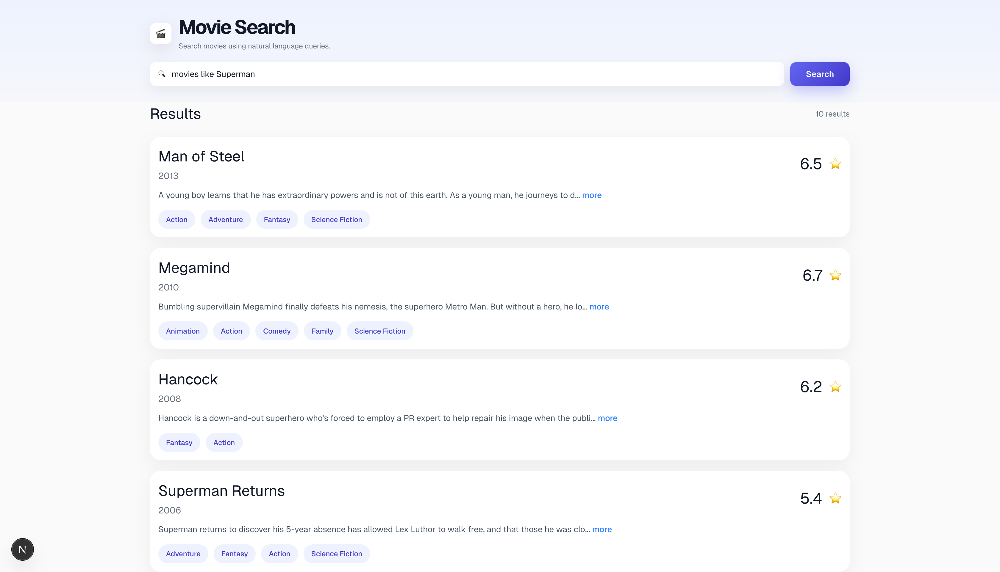

This is a [Next.js](https://nextjs.org) project bootstrapped with [`create-next-app`](https://nextjs.org/docs/app/api-reference/cli/create-next-app).

## Getting Started

First, run the development server:

```bash
pnpm dev
```

Open [http://localhost:3000](http://localhost:3000) with your browser to see the result.


## About the App

Simple movie search app using the TMDB data, built with PostgreSQL + pgvector + Ollama, with search from a simple Next.js app.

Movie metadata is imported from TMDB dataset and the aim is to try out natural-language search using vector embeddings instead of traditional keyword-only matches.

TMDB dataset CSV → raw_movies → cleaned items table → embeddings. The cleaned table contains the embeddings along with
other basic movie fields.

Embeddings are generated locally using the model `nomic-embed-text`. The embedding input format is `Title + Genres + Keywords + Overview`

## Search Behaviour 

1. Semantic Search
- User input  is converted into an embedding and it is matched against movie embeddings using pgvector similarity search.
- What's seen is that it works fine for any non-recommendation style search terms:
  - themes
  - genres
  - descriptive searches

Example:
"space movies about saving earth"

Flow:
query text → embedding → vector similarity search


2. Recommendation-Style Search
- Detect recommendation-style queries like:
  "movies like Interstellar"
- For this, find the target movie from DB and use it's existing embedding directly for nearest-neighbor search
- Best for:
  - similar movies
  - recommendation queries

Flow:
extract movie title → fetch movie embedding → nearest-neighbor vector search

## App Screenshot



## Database

DDL generated from the existing table in Postgres (lost the initial create table)

```
CREATE TABLE public.items (
	id serial4 NOT NULL,
	title text NULL,
	description text NULL,
	genre text NULL,
	release_date date NULL,
	"year" int4 NULL,
	vote_average float8 NULL,
	keywords text NULL,
	embedding public.vector NULL,
	CONSTRAINT items_pkey PRIMARY KEY (id)
);
CREATE INDEX items_embedding_idx ON public.items USING ivfflat (embedding) WITH (lists='100');
```